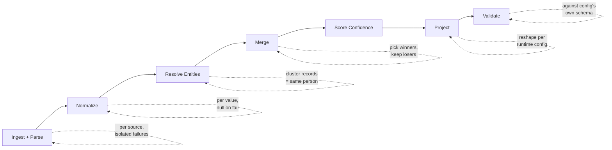
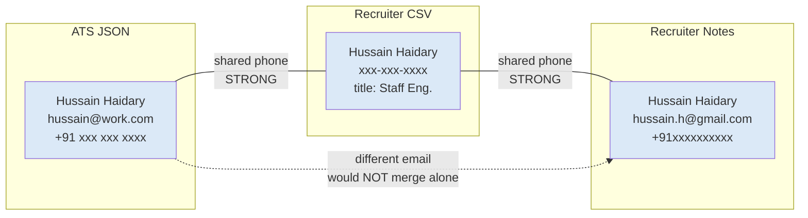

# Multi-Source Candidate Data Transformer — Technical Design (Stage 1)

*[Your Name] · [your.email] · Eightfold Engineering Intern (Jul–Dec 2026)*

## Problem

Candidate data arrives from several sources at once — structured (ATS JSON,
recruiter CSV) and unstructured (recruiter notes, GitHub). The same person may
appear in several sources with conflicting values; any source may be missing,
empty, or malformed. The task: produce **one canonical profile per candidate** —
normalized formats, deduplicated values, a record of **where each value came
from**, and **how confident** we are in it. Wrong-but-confident is worse than
honestly-empty.

## Pipeline

The **canonical record**, built by stage D/E, is the single source of truth and
is treated as immutable once built: sources map *into* it, the projection reads
*out of* it and never mutates it (a conveyor belt with checkpoints).

## Canonical schema (internal)

`candidate_id`, `full_name`, `emails[]`, `phones[]`,
`location{city, region, country}`, `links{linkedin, github, portfolio, other[]}`,
`headline`, `years_experience`, `skills[{name, confidence, sources[]}]`,
`experience[{company, title, start, end, summary}]`,
`education[{institution, degree, field, end_year}]`,
`provenance[{field, source, method}]`, `overall_confidence`.

**Normalized formats:** phones → E.164 (libphonenumber; invalid rejected, not
coerced); countries → ISO-3166 alpha-2; dates → `YYYY-MM` (bare year → `-01`;
"Present" → null = ongoing); skills → canonical names (alias table; unknowns
kept, never dropped). Every normalizer returns a clean value **or null** —
never invents.

## Entity resolution — the core (where this beats a folder-per-person design)

**Tiered match signals:**
- **Strong (merge on a single shared value):** normalized email, E.164 phone.
  Near-unique identifiers.
- **Weak (never merge alone; only corroborate within a cluster):** name-key,
  employer, location.

**Clustering:** union-find. Two records sharing *any* strong signal join one
cluster. This catches the case email-only matching misses — same person with a
work email in the ATS and a personal email in notes still merges via a shared
phone. Weak signals never *initiate* a merge, which prevents the catastrophic
over-merge (two different "John Smith"s collapsing into one corrupted profile).

*Email alone would split this into two people (A1/N1 don't share an email).
Phone is the strong signal that correctly links all three into one cluster.*

**Why strong-only:** over-merging destroys data irreversibly; under-merging
leaves two honest partial profiles. Given "wrong-but-confident is worse than
honestly-empty," we bias toward the safer error.

## Merge / conflict resolution

Within a cluster, each field is resolved independently:
- **Winner = source-trust, but corroboration overrides.** Trust ranks
  ATS > CSV > GitHub > notes. A value seen in two independent sources beats a
  lone value from a higher-trust source — agreement is evidence.
- **Losers are retained in `provenance`**, never silently dropped — so a wrong
  pick is auditable, not invisible.
- **List fields** (emails, phones, skills) are unioned, not contested.
- **GitHub is enrichment-only:** it never participates in matching, only
  attaches skills/links to an already-resolved candidate.

## Confidence (derived, not asserted)

Per-field confidence = function of three factors we can name:
`source_trust × corroboration_bonus × normalization_success`.
A phone seen in two sources and E.164-valid scores high; a title from one noisy
source that won a conflict scores medium. `overall_confidence` is a transparent
weighted aggregate biased toward identifying fields (name/email/phone), because
a profile we can't identify is worth little even if skill-rich.

## Runtime custom-output config (projection + validation)

Same engine, no code changes. A JSON/YAML config: selects a subset of fields,
renames/remaps from a canonical path (`emails[0]` → `primary_email`,
`skills[].name` → flat `string[]`), sets per-field normalization, toggles
provenance/confidence, and chooses missing-value behavior: **null | omit |
error**. The output is validated against a schema **derived from the config**
(the output's contract is whatever the config asked for), not the canonical
schema. The config itself is validated *before* the pipeline runs, so
misconfiguration fails fast.

## Edge cases (and how we handle them)

1. **Ghost candidate** (name, no email/phone): no strong key → cannot be safely
   merged. **Quarantine** + warn; surface separately. *(Workaround under design
   — see open question.)*
2. **Format chaos** (`(415) 555-2671` vs `+1 415 555 2671`): both normalize to
   one E.164; structurally-invalid numbers rejected.
3. **Config references an unknown canonical field:** caught by config validation
   before the run, with a clear message.
4. **Garbage / malformed source:** isolated inside its parser; logged as a
   warning; the run continues on the remaining sources.
5. **Conflicting values across sources:** resolved by trust + corroboration; the
   losing value's provenance is retained.

## Deliberately descoped (24h timebox)

LLM-based extraction (deterministic rules instead — explainable & reproducible);
live OAuth (GitHub via public API + mockable interface); persistent storage
(in-memory); fuzzy/ML name dedupe (name kept as a weak signal only).

## Constraints met

Deterministic (same inputs → same output; stable sort) · explainable (every
value traceable to source + method) · robust (garbage never crashes; unknown →
null, never invented) · scales (in-memory, near-linear union-find).
